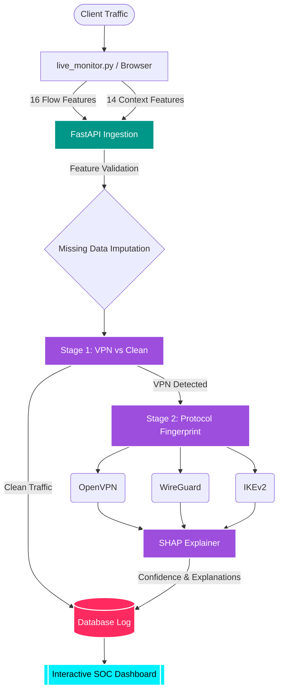

# 🛡️ VPN Sentinel

**VPN Sentinel** is an advanced, machine-learning-powered network security system designed to detect, classify, and explain VPN and proxy usage in real-time. Whether analyzing low-level network packets or high-level browser contexts, VPN Sentinel exposes hidden traffic using a multi-stage AI pipeline.


---

## ⚙️ How It Works: Step-by-Step

VPN Sentinel relies on a highly robust **Multi-Stage Inference Pipeline**. Depending on the data source, traffic is routed through either our **Flow Model** (for raw network packets) or our **Browser Model** (for web application traffic).

### 1️⃣ Traffic Interception & Feature Extraction
The system captures traffic using a live packet sniffer (`live_monitor.py`) or receives browser-level telemetry via our REST API. It extracts complex features while disregarding payloads (protecting user privacy):
- **Flow Statistics:** Packet Inter-Arrival Time (IAT) mean, variance, jitter ratios, and packet length distributions.
- **Browser Context:** WebRTC IP leaks, timezone conflicts, and HTTP proxy headers.

### 2️⃣ Stage 1: Anomaly Detection (VPN vs. Non-VPN)
The extracted features are fed into our **Stage 1 Random Forest Classifier**. 
- The model evaluates 16 flow features or 12 browser signals to determine if the traffic originates from a VPN/Proxy or a standard residential ISP.
- Trained against adversarial traffic-shaping (packet padding & timing delays), ensuring high evasion resistance.

### 3️⃣ Stage 2: Protocol Fingerprinting
If Stage 1 flags the traffic as a VPN, it is immediately passed to the **Stage 2 Protocol Fingerprinter**.
- The model classifies the exact tunneling protocol used: **OpenVPN, WireGuard, or IKEv2**.
- This enables granular security policies (e.g., allowing corporate IPSec while blocking consumer WireGuard).

### 4️⃣ SHAP Explainability & Alerting
VPN Sentinel doesn't just block traffic—it explains *why*. 
- A SHAP (SHapley Additive exPlanations) TreeExplainer analyzes the model's decision path.
- It outputs exactly which features (e.g., `fwd_pkt_len_std` or `webrtc_ip_mismatch`) contributed most to the VPN classification.

---

## 📊 System Architecture Visualized



---

## 🧠 Model Features Breakdown

Our models are trained on highly specific dimensions to prevent overfitting and guarantee accuracy.

| Model Type | Features Used | Key Data Points |
| :--- | :--- | :--- |
| **Flow Model** | 16 Features | `duration`, `packets_per_sec`, Packet length constraints (min/max/std), IAT constraints (min/max/std), `jitter_ratio` |
| **Browser Model** | 12 Features | Timing basics + `webrtc_blocked`, `timezone_mismatch_score`, `language_mismatch_score`, `is_datacenter_ip` |

---

## 🚀 Key Capabilities

- **Adversarial Robustness:** Resists traffic shaping, packet padding, and evasion tools.
- **Glassmorphism SOC Dashboard:** Beautiful, real-time frontend mapping global threats and traffic logs.
- **Protocol Deep-Dive:** Distinguishes between modern UDP/TCP VPN protocols seamlessly.
- **No-Payload Inspection:** 100% privacy-compliant; we never decrypt or inspect packet payloads (Deep Packet Inspection is not required).

---

## 🛠️ Getting Started

1. **Train the Models:**
   ```bash
   python train_models.py
   ```
2. **Start the API Server:**
   ```bash
   uvicorn backend.main:app --reload
   ```
3. **Launch the Live Monitor (Run as Admin/Root):**
   ```bash
   python live_monitor.py
   ```
4. **Access the Dashboard:** Navigate to `http://localhost:8000/` in your browser.
