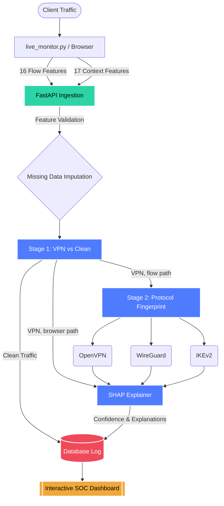

# 🛡️ VPN Sentinel

**Detects VPN and proxy usage in real time — from raw network traffic or straight from a browser — and explains *why* it flagged something, not just that it did.**


**🌐 Live demo:** [vpncheck.in](https://vpncheck.in) &nbsp;•&nbsp; **📓 Full walkthrough notebook:** [`VPN_Sentinel_Main.ipynb`](VPN_Sentinel_Main.ipynb)

---

## 🧭 What is this?

Most VPN detectors just check an IP against a blocklist — easy for any half-decent VPN to evade. VPN Sentinel combines that with *behavioral* signals that are much harder to fake: how packets are timed, whether a browser's WebRTC leaks its real IP, whether the GPU looks like a cloud VM instead of a real laptop, whether the browser is being driven by automation. It's a two-stage ML pipeline:

- **Stage 1** — is this traffic VPN or clean? (Random Forest, trained on real packet captures + synthetic data, resistant to adversarial evasion)
- **Stage 2** — if it's a VPN, which protocol? (OpenVPN, WireGuard, or IKEv2 — raw-packet path only)
- **Explainability** — every prediction ships with a SHAP breakdown of exactly which feature drove the decision, in plain language
- **Calibrated confidence** — probabilities are Platt-scaled against held-out data, so a reported
  95% means "correct about 95% of the time" rather than merely "95% of trees agreed"

There are two parallel models depending on what data is available: a **Flow Model** for raw network packet statistics, and a **Browser Model** for client-side telemetry when you only have a web request to work with.

### Why this is more than "prompted an LLM to build an app"

The interesting part isn't the feature list — it's the bugs that surfaced from actually stress-testing the pipeline end-to-end, not just eyeballing a demo:
- The model claimed adversarial robustness in its docs, but Stage 1 had never actually been trained on adversarial examples — only Stage 2 had. Fixed and verified (adversarial accuracy went from a real ~40-57% collapse to 98%).
- Stage 1 and Stage 2 were trained on two datasets with incompatible feature scales, so they silently disagreed about what "VPN" looks like — every demo button on the dashboard was misclassified as a result. Fixed by aligning both training sets.
- A cold-start network timeout was silently misclassifying the first request after every server restart, because a slow DNS lookup was falling back to a "clean" default under time pressure.

---

## ⚙️ How It Works: Step-by-Step

VPN Sentinel relies on a highly robust **Multi-Stage Inference Pipeline**. Depending on the data source, traffic is routed through either our **Flow Model** (for raw network packets) or our **Browser Model** (for web application traffic).

### 1️⃣ Traffic Interception & Feature Extraction
The system captures traffic using a live packet sniffer (`project/ml/live_monitor.py`) or receives browser-level telemetry via our REST API. It extracts complex features while disregarding payloads (protecting user privacy):
- **Flow Statistics:** Packet Inter-Arrival Time (IAT) mean, variance, jitter ratios, and packet length distributions.
- **Browser Context:** WebRTC IP leaks, timezone/language conflicts, connection timing patterns, WebGL GPU fingerprint, and HTTP proxy headers.

### 2️⃣ Stage 1: Anomaly Detection (VPN vs. Non-VPN)
The extracted features are fed into our **Stage 1 Random Forest Classifier**. 
- The model evaluates 16 flow features or 17 browser signals to determine if the traffic originates from a VPN/Proxy or a standard residential ISP.
- Trained against adversarial traffic-shaping (packet padding & timing delays), ensuring high evasion resistance.

### 3️⃣ Stage 2: Protocol Fingerprinting
If the **flow** model flags traffic as a VPN, it is passed to the **Stage 2 Protocol Fingerprinter**.
- The model classifies the exact tunneling protocol used: **OpenVPN, WireGuard, or IKEv2** (~96% accurate).
- This enables granular security policies (e.g., allowing corporate IPSec while blocking consumer WireGuard).
- Protocol fingerprinting is deliberately **not** offered on the browser path: browser-observable
  signals are near-identical across protocols, so it plateaued around 71% on three classes and
  reporting it implied more certainty than the data supports.

### 4️⃣ SHAP Explainability & Alerting
VPN Sentinel doesn't just block traffic—it explains *why*. 
- A SHAP (SHapley Additive exPlanations) TreeExplainer analyzes the model's decision path.
- It outputs exactly which features (e.g., `fwd_pkt_len_std` or `webrtc_ip_mismatch`) contributed most to the VPN classification.

---

## 📊 System Architecture Visualized


```mermaid
graph TD
    %% Core Inputs
    Client([Client Traffic]) --> Sniffer[live_monitor.py / Browser]
    Sniffer --> |16 Flow Features| API[FastAPI Ingestion]
    Sniffer --> |17 Context Features| API
    
    %% Processing
    API --> |Feature Validation| Imputer{Missing Data Imputation}
    Imputer --> Stage1[Stage 1: VPN vs Clean]
    
    %% Stage 1 Logic
    Stage1 -->|Clean Traffic| DB[(Database Log)]
    Stage1 -->|VPN, flow path| Stage2[Stage 2: Protocol Fingerprint]
    Stage1 -->|VPN, browser path| SHAP
    
    %% Stage 2 Logic
    Stage2 --> OpenVPN(OpenVPN)
    Stage2 --> WireGuard(WireGuard)
    Stage2 --> IKEv2(IKEv2)
    
    %% Explainability
    OpenVPN --> SHAP[SHAP Explainer]
    WireGuard --> SHAP
    IKEv2 --> SHAP
    
    SHAP --> |Confidence & Explanations| DB
    
    %% Output
    DB --> Dashboard[[Interactive SOC Dashboard]]
    
    %% Styling
    classDef api fill:#2dd4a7,stroke:#fff,stroke-width:2px,color:#000;
    classDef model fill:#4f7cff,stroke:#fff,stroke-width:2px,color:#fff;
    classDef db fill:#ef4a5a,stroke:#fff,stroke-width:2px,color:#fff;
    classDef dash fill:#f0a83c,stroke:#fff,stroke-width:2px,color:#000;
    
    class API api;
    class Stage1,Stage2,SHAP model;
    class DB db;
    class Dashboard dash;
```

---

## 🧠 Model Features Breakdown

Our models are trained on highly specific dimensions to prevent overfitting and guarantee accuracy.

| Model Type | Features Used | Key Data Points |
| :--- | :--- | :--- |
| **Flow Model** | 16 Features | `duration`, `packets_per_sec`, Packet length constraints (min/max/std), IAT constraints (min/max/std), `jitter_ratio` |
| **Browser Model** (detection only) | 17 Features | Timing basics + `webrtc_blocked`, `timezone_mismatch_score`, `language_mismatch_score`, `is_datacenter_ip`, `is_virtual_gpu`, `is_automation_flagged`, `low_font_count` |

Both classifiers are **Random Forests with Platt (sigmoid) probability calibration** — `predict_proba` on a raw forest is just "what fraction of trees voted this way," which tends to be over- or under-confident near the extremes. Calibration is fit on a held-out slice and verified with a before/after Brier score at training time, so a reported confidence is a truthful number, not just a popular one.

---

## 🔍 Every Detection Signal, In Detail

VPN Sentinel doesn't lean on any single tell — it correlates a dozen independent signals, each individually spoofable but expensive to fake in combination:

| Signal | Where it runs | What it actually checks |
| :--- | :--- | :--- |
| **Flow timing (IAT mean/std/jitter)** | Server (raw packets) | Tunnels re-time and re-pace packets in ways plain TCP/UDP traffic doesn't |
| **Packet length stats (min/max/std)** | Server (raw packets) | Encapsulation overhead shifts packet-size distributions in protocol-specific ways |
| **IP reputation** | Server | Cross-checks `ipapi.is` / `ip-api.com` datacenter, VPN, Tor and proxy flags against a curated ISP/org/ASN keyword list (word-boundary matched to avoid false hits like "opera**tor**") |
| **WebRTC IP leak / mismatch** | Browser + Server | Compares the IP WebRTC's STUN path reveals against the HTTP-observed IP — ASN and country mismatch, family-aware (IPv4 vs IPv6) so dual-stack clients aren't punished |
| **Timezone mismatch** | Browser + Server | Compares the browser's IANA timezone against the IP's geolocated timezone, with a UTC-offset fallback and alias table for renamed zones |
| **Language mismatch** | Browser + Server | Flags a browser language that doesn't belong to the visiting IP's country, using a real per-country language map |
| **Geo-IP distance** | Browser (opt-in GPS) + Server | Haversine distance between GPS coordinates (if permission granted) and the IP's geolocated coordinates |
| **Proxy header detection** | Server | Inspects `Via` and excess `X-Forwarded-For` hops beyond the deployment's own trusted edge |
| **WebGL GPU fingerprint** | Browser | Datacenter/VPS exit nodes almost always report a software renderer (SwiftShader, llvmpipe, Mesa) instead of real GPU hardware |
| **Browser automation flag** | Browser | Reads `navigator.webdriver`, set by headless tools like Selenium/Puppeteer/Playwright |
| **Font-count fingerprint** | Browser | Measures rendering-width deltas across candidate fonts vs. baseline fonts — VMs and headless environments have a much smaller installed-font set than real desktops |
| **DNS/extension ad-block detection** | Browser | Pings a known ad-server URL and times *how* the request fails to tell a DNS-level blocker (Pi-hole, NextDNS, AdGuard DNS) apart from a browser extension blocker — used as one more environment signal, not as an ad-blocking feature itself |
| **Brave browser detection** | Browser | Checks the `navigator.brave` API as an additional environment fingerprint |

---

## 🚀 Key Capabilities

- **Adversarial Robustness:** Trained against simulated packet padding and timing-randomization evasion (`ml/adversarial_shaper.py`); Stage 1 adversarial accuracy holds at 98% after fixing a scale mismatch that previously collapsed it to ~40-57%.
- **Real-Time SOC Dashboard:** Live frontend mapping global threats and traffic logs, responsive on desktop and mobile.
- **Protocol Deep-Dive:** Distinguishes OpenVPN, WireGuard and IKEv2 on the raw-packet path (~96%).
- **No-Payload Inspection:** 100% privacy-compliant; we never decrypt or inspect packet payloads (Deep Packet Inspection is not required).
- **TLE Policy Enforcement:** VPN sessions that run past a configurable duration threshold (default 30s) are flagged as a Time Limit Exceeded policy violation.
- **Rate Limiting:** `/api/ingest` is capped at 30 requests per 60s per client IP (in-memory sliding window) to prevent abuse of the inference pipeline.
- **Multi-Tenant Ready:** Every ingest/stats/history call is scoped by a `tenant` query param or `X-Tenant-Id` header, so one deployment can serve isolated stats to multiple customers.
- **Live Packet Sniffer:** `ml/live_monitor.py` uses Scapy to track real flows on a network interface, compute the same 16 flow features live, and stream them to the inference API every 3 seconds.
- **Embeddable Widget:** `widget/vpn-widget.js` drops a live-updating "Active Tunnels" badge with a protocol breakdown onto any third-party site with a single `<script>` tag.
- **IP Lookup Tool:** A standalone `/ip` reputation checker, proxied server-side to avoid the mixed-content issues of calling HTTP-only geo-IP APIs from an HTTPS page.

---

## 📁 Project Structure

```
.
├── README.md
├── VPN_Sentinel_Main.ipynb        # 📓 Full analysis walkthrough — start here
└── project/                       # The application itself
    ├── backend/                   #   FastAPI inference API
    │   ├── main.py                #     routes, feature extraction, model serving
    │   └── database.py            #     SQLAlchemy models + migrations
    ├── frontend/                  #   Dashboard, browser scan, threat intel, docs
    ├── ml/                        #   Training pipeline
    │   ├── train_models.py        #     trains + exports all four models
    │   ├── data_generator.py      #     synthetic dataset generation
    │   ├── adversarial_shaper.py  #     traffic-shaping evasion simulation
    │   └── live_monitor.py        #     live packet sniffer
    ├── models/                    #   Trained .pkl artifacts + feature lists
    ├── notebooks/                 #   Supporting/earlier analysis notebooks
    ├── widget/                    #   Embeddable third-party widget
    ├── Dockerfile
    └── requirements.txt
```

---

## 🛠️ Getting Started

Run these from inside the **`project/`** directory:

```bash
cd project
```

1. **Install dependencies:**
   ```bash
   pip install -r requirements.txt
   ```
2. **Train the models:**
   ```bash
   python ml/train_models.py
   ```
3. **Start the API server:**
   ```bash
   uvicorn backend.main:app --reload
   ```
4. **Access the dashboard:** open `http://localhost:8000/` in your browser.

Optionally, to capture live network traffic (requires Admin/root):
```bash
python ml/live_monitor.py
```

The walkthrough notebook lives at the repo root and resolves paths into
`project/` automatically, so run Jupyter from the root:
```bash
jupyter notebook VPN_Sentinel_Main.ipynb
```

> **Deploying:** the app is not at the repository root, so set your platform's
> root/base directory to `project` (on Render: *Settings → Build & Deploy →
> Root Directory*). The start command itself stays `uvicorn backend.main:app`.

---

## 📬 Contact

Built by **Vivek Dhamale**. Questions, feedback or collaboration — happy to hear from you.

| | |
| :--- | :--- |
| ✉️ **Email** | [vivekdhamale71@gmail.com](mailto:vivekdhamale71@gmail.com) |
| 📸 **Instagram** | [@_kevivek_](https://instagram.com/_kevivek_) |
| 💻 **GitHub** | [@kevivek-cyber](https://github.com/kevivek-cyber) |
